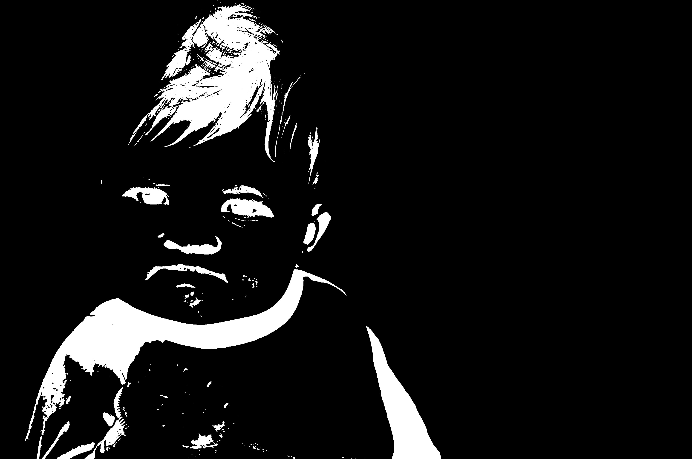

Regions of Interest Maximum Symmetric Surround Saliency Algorithm
============

## Quick Start Guide

```bash
SaliencyDetector [options] inputfile.jpg outputfile.jpg

-h, --help        display this help and exit
-q, --quiet       quiet mode
-v, --verbose     enable verbose mode
-V, --version     print program version

--normalize       normalize greyscale output

--threshold       convert saliency map to a two colour image
-L<num>           lower threshold (def. 12.5 %) for black cut-off for two colour conversion.
-U<num>           upper threshold (def. 75%) for white cut-off for two colour conversion
Note: setting either of the above two implies --threshold

--blocks          convert saliency map to series of averaged blocks
--qblocks         convert saliency map to series of averaged blocks quantized to 4 colours.
```

## Introduction

Detection of visually salient image regions is useful for applications like object segmentation, adaptive compression and object recognition. Recently, full-resolution salient maps that retain well-defined boundaries have attracted attention. In these maps, boundaries are preserved by retaining substantially morefrequency content from the original image than older techniques. However, if the salient regions comprise more than half the pixels of the image, or if the background is complex, the background gets highlighted instead of the salient object.

Maximum Symmetric Surround Saliency is a method for salient region detection that retains the advantages of full resolution saliency maps with well-defined boundaries while overcoming their shortcomings. It exploits features of color and luminance, is simple to implement and is computationally efficient.

## Build Instructions

Go to /Release (or /Debug if you want all debugging flags built in) and run "make all" to generate the "SaliencyDetector" binary which you can put in your local $PATH.

We successfully ran builds on both OSX and Linux, provided that a current version of ImageMagick is installed on your system as we rely on ImageMagick for gobbling up the image binary data and outputting the resulting saliency-map image.

Needs (Ubuntu / Debian):

```
sudo apt install libmagick++-dev
```

or (on RHEL):
```
sudo dnf install libmagick++-dev
```

There are up-to-date precompiled OSX binaries of SaliencyDetector available in the /Binary directory within this repository.

## Examples

**Success Meme Baby**
[](https://raw.github.com/technopagan/mss-saliency/master/imagedemo/success-meme-baby.jpg)
Let's look at the famous "Success!" baby photo as a quick demo of our saliency detector.

**Success Meme Baby, saliency mapped**
[](https://raw.github.com/technopagan/mss-saliency/master/imagedemo/success-meme-baby-salient.jpg)
This is the native output of MSSS.

**Success Meme Baby, salient two colors**
[](https://raw.github.com/technopagan/mss-saliency/master/imagedemo/success-meme-baby-salient-2color.jpg)
Here we used the inbuilt --threshold switch to reduce the saliency map to only 2-color black and white pixels, which makes the salient regions very easy to detect programmatically.

Note how the saliency detector has successfully ignored the background as well as monotone areas in the foreground so that only detailed, multicolored areas stay as parts of the regions of interest. This way, processes like adaptive compression have an awesome basis to operate on.

## Credits

 * [Radhakrishna Achanta](http://ivrg.epfl.ch/people/achanta)
 * [Neil Jedrzejewski](http://www.wunderboy.org/about.php)
 * [Tobias Baldauf](http://who.tobias.is/)

## Licence

This software is published under the BSD licence 3.0

Copyright (c) 2014, Tobias Baldauf
All rights reserved.

Mail: [kontakt@tobias-baldauf.de](mailto:kontakt@tobias-baldauf.de)
Web: [who.tobias.is](http://who.tobias.is/)
Twitter: [@tbaldauf](http://twitter.com/tbaldauf)

Redistribution and use in source and binary forms, with or without modification, are permitted provided that the following conditions are met:

 * Redistributions of source code must retain the above copyright notice, this list of conditions and the following disclaimer.
 * Redistributions in binary form must reproduce the above copyright notice, this list of conditions and the following disclaimer in the documentation and/or other materials provided with the distribution.
 * Neither the name of the author nor the names of contributors may be used to endorse or promote products derived from this software without specific prior written permission.

THIS SOFTWARE IS PROVIDED BY THE COPYRIGHT HOLDERS AND CONTRIBUTORS "AS IS" AND ANY EXPRESS OR IMPLIED WARRANTIES, INCLUDING, BUT NOT LIMITED TO, THE IMPLIED WARRANTIES OF MERCHANTABILITY AND FITNESS FOR A PARTICULAR PURPOSE ARE DISCLAIMED. IN NO EVENT SHALL THE COPYRIGHT HOLDER OR CONTRIBUTORS BE LIABLE FOR ANY DIRECT, INDIRECT, INCIDENTAL, SPECIAL, EXEMPLARY, OR CONSEQUENTIAL DAMAGES (INCLUDING, BUT NOT LIMITED TO, PROCUREMENT OF SUBSTITUTE GOODS OR SERVICES; LOSS OF USE, DATA, OR PROFITS; OR BUSINESS INTERRUPTION) HOWEVER CAUSED AND ON ANY THEORY OF LIABILITY, WHETHER IN CONTRACT, STRICT LIABILITY, OR TORT (INCLUDING NEGLIGENCE OR OTHERWISE) ARISING IN ANY WAY OUT OF THE USE OF THIS SOFTWARE, EVEN IF ADVISED OF THE POSSIBILITY OF SUCH DAMAGE.
